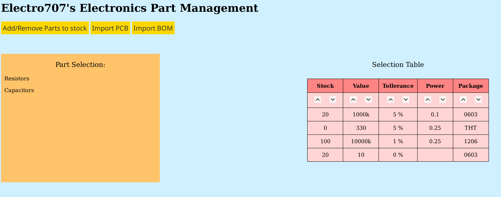

#### Note: This is still in development, but feel free to explore around :)

# Electro707's Electronic Parts Management System (EEPMS)

This website is for an electronics/hobbyist parts management, complete (or will be) with parametric searches, and beign able to import a BOM file to add to your stock, and more features. This project started because I couldn't find any adequate part management systems (cathered to electronics) that I liked.

Here is a screenshot at the software as of one of the latest commits:

## TODO:

- [ ] Create the parametric search
- [x] Convert a number to it's engineering notation (1000 to 1k for example)
- [ ] Better layout the page
- [ ] Handle if a column doesn't exist
- [x] Handle if a table doesn't exist
- [x] Handle an 'initializer' for the database
- [ ] Add more components
- [ ] Add sorting in the table
- [ ] Add import BOM option
- [ ] Add import PCB option
- [ ] Add PCB-assembly import to check against stock
- [ ] Add GUI to add to stock
- [ ] Add GUI to add new component
- [ ] Add a cross-link between the parts and Octopart 

## Database

The database is a mySql database, with the database name called "PartsList". Each part has it's own table, and is created if a part is clicked and the table doesn't exist. As of right now, there is no way to add a part except for manually doing it thru something like phpMyAdmin. This feature will be added in the future :)
