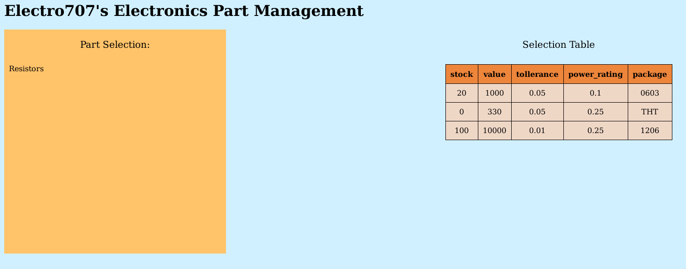

#### Note: This is still in development, but feel free to explore :)

# Electro707's Electronic Parts Management System (EEPMS)

This website is for an electronics/hobbyist parts management, complete (or will be) with parametric searches, and beign able to import a BOM file to add to your stock, and more features. This project started because I couldn't find any adequate part management systems (cathered to electronics) that I liked.

Here is a screenshot at the software as of the first commit:

## TODO:

- Create the parametric search
- Convert a number to it's engineering notation (1000 to 1k for example)
- Better layout the page
- Handle if a column/table doesn't exist
- Handle an 'initializer' for the database
- Add more components
- Add sorting in the table
- Add import BOM option
- Add import PCB option

## Database

The database is a mySql database, with the database name called "PartsList". Inside, as of right now only a single table exist called 'resistors' with the following format:

|Column Name|Type|
|-----------|----|
|stock|int(11)|
|value|float|
|tollerance|float|
|power_rating|float|	
